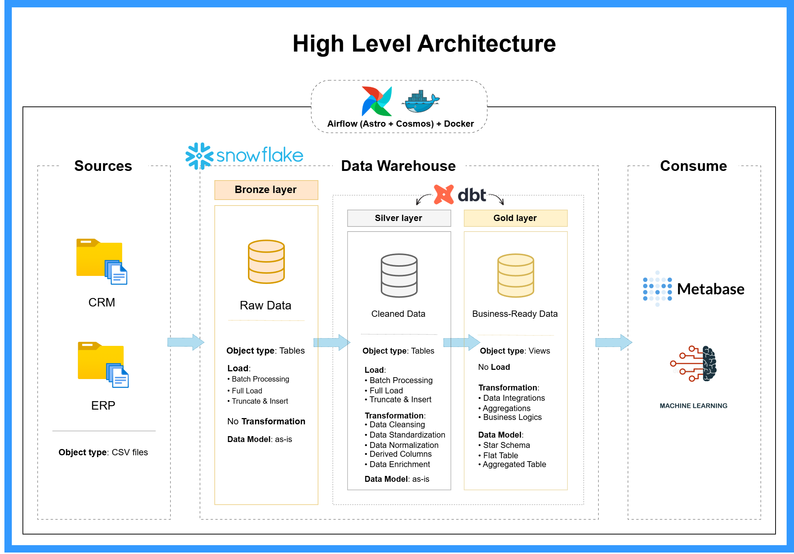

# Modern Data Stack Pipeline

A robust, end-to-end data pipeline built with the modern data stack. It extracts raw data using Python, loads it into Snowflake, transforms it using dbt, and orchestrates the entire workflow with Apache Airflow (running on Astronomer).



## 🚀 Key Features

- **Automated Ingestion:** Custom Python scripts (`bronze_scripts`) fetch and load raw data into the Bronze layer in Snowflake.
- **dbt Transformation:** dbt Core is used for data modeling, transforming raw data into clean Silver and Gold layers.
    - **Silver:** Cleaned and standardized tables.
    - **Gold:** Business-ready views/marts.
- **Airflow Orchestration:** Complex workflows managed by Airflow, utilizing [Cosmos](https://github.com/astronomer/cosmos) to integrate dbt as native Airflow tasks.
- **Containerized:** Fully Dockerized environment for consistent local development and deployment.
- **Snowflake:** Scalable cloud data warehouse as the central data repository.

## 🛠️ Tech Stack

- **Orchestration:** [Apache Airflow](https://airflow.apache.org/) (via [Astronomer](https://www.astronomer.io/))
- **Data Warehouse:** [Snowflake](https://www.snowflake.com/)
- **Transformation:** [dbt Core](https://www.getdbt.com/)
- **Language:** Python 3.9+
- **Infrastructure:** Docker & Docker Compose

## 📂 Project Structure

```text
modern-data-stack-pipeline/
├── bronze_scripts/      # Python scripts for raw data ingestion (Source -> Bronze)
├── dags/                # Airflow DAGs (orchestration logic)
├── dbt/                 # dbt project root
│   └── dbt_project/     # Main dbt project folder (models, seeds, etc.)
├── docs/                # Documentation and assets
├── Dockerfile           # Custom Airflow image definition
├── docker-compose.yml   # (Implicit via Astro/Docker)
└── packages.txt         # OS-level dependencies
```

## ⚙️ Setup & Installation

### Prerequisites

- [Docker Desktop](https://www.docker.com/products/docker-desktop) installed and running.
- [Astro CLI](https://docs.astronomer.io/astro/cli/install-cli) (Recommended) or basic Docker Compose.
- A **Snowflake** account.

### 1. Clone the Repository

```bash
git clone https://github.com/aliadel01/modern-data-stack-pipeline.git
cd modern-data-stack-pipeline
```

### 2. Configure Environment

Ensure your Airflow environment can verify credentials.
*Note: This project uses a connection ID `snowflake_default` in Airflow.*

### 3. Setup Snowflake Connection in Airflow

Once Airflow is running (see step 4), you need to configure the connection.

1.  Go to **Admin** -> **Connections** in the Airflow UI.
2.  Create a new connection:
    -   **Conn Id:** `snowflake_default`
    -   **Conn Type:** `Snowflake`
    -   **Schema:** `PUBLIC` (or your default)
    -   **Login:** `<Your Snowflake Username>`
    -   **Password:** `<Your Snowflake Password>`
    -   **Account:** `<Your Snowflake Account Identifier>`
    -   **Extra:** JSON config with warehouse, database, role, etc.

### 4. Run the Project

Using Astro CLI:

```bash
astro dev start
```

Or using Docker Compose directly (if configured):

```bash
docker-compose up
```

Access the Airflow UI at `http://localhost:8080`.

## 🏃‍♂️ Usage

1.  **Trigger the Pipeline:**
    -   Navigate to the Airflow UI.
    -   Unpause and trigger the `pipeline` DAG.
2.  **Monitor Progress:**
    -   Watch the `load_bronze_task` execute the Python ingestion.
    -   Observe the `run_dbt` task group expand and run your dbt models (Silver -> Gold).
3.  **Check Output:**
    -   Log in to Snowflake.
    -   Verify data in `SALES_DWH.SILVER` and `SALES_DWH.GOLD` schemas.


#### Built with ❤️ 
##### using [dbt](https://www.getdbt.com/), [Airflow](https://airflow.apache.org/), and [Snowflake](https://www.snowflake.com/).
